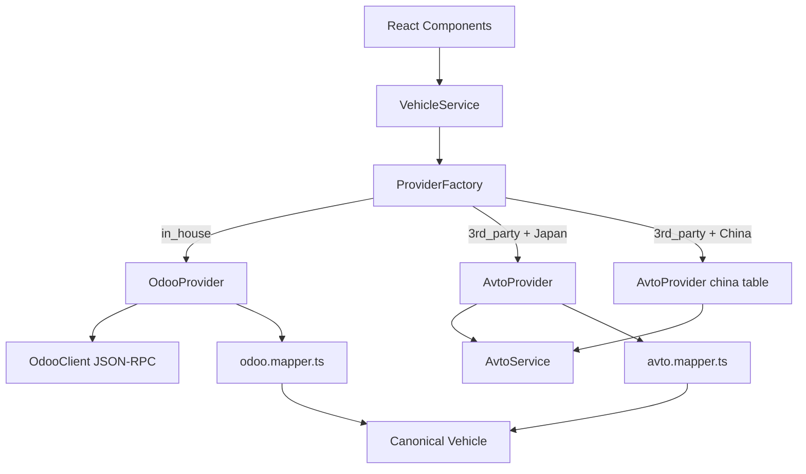

# Phase 2 Walkthrough — Canonical Data & Provider Abstraction

## What Was Built

9 new files + 1 modified file forming a clean data abstraction layer:

## Files Created

| File | Purpose |
|------|---------|
| [site.config.ts](file:///Users/shazz/Desktop/Projects/barkaat-software-solutions/revamp/src/lib/config/site.config.ts) | Runtime defaults, country→provider map, fallback lists |
| [canonical-vehicle.ts](file:///Users/shazz/Desktop/Projects/barkaat-software-solutions/revamp/src/types/canonical-vehicle.ts) | Unified `Vehicle`, `VehicleFilters`, `MakeEntry`, `ModelEntry` |
| [avto.mapper.ts](file:///Users/shazz/Desktop/Projects/barkaat-software-solutions/revamp/src/lib/mappers/avto.mapper.ts) | AvtoVehicle → Vehicle (image parsing, fuel/transmission decoding) |
| [odoo.mapper.ts](file:///Users/shazz/Desktop/Projects/barkaat-software-solutions/revamp/src/lib/mappers/odoo.mapper.ts) | OdooVehicle → Vehicle (stub, x_ field mapping) |
| [types.ts](file:///Users/shazz/Desktop/Projects/barkaat-software-solutions/revamp/src/lib/providers/types.ts) | `VehicleProvider` interface contract |
| [avto.provider.ts](file:///Users/shazz/Desktop/Projects/barkaat-software-solutions/revamp/src/lib/providers/avto.provider.ts) | Avto implementation with China table routing |
| [odoo.provider.ts](file:///Users/shazz/Desktop/Projects/barkaat-software-solutions/revamp/src/lib/providers/odoo.provider.ts) | Odoo implementation with graceful error handling |
| [provider.factory.ts](file:///Users/shazz/Desktop/Projects/barkaat-software-solutions/revamp/src/lib/providers/provider.factory.ts) | Factory resolving source+country → correct provider |
| [vehicle.service.ts](file:///Users/shazz/Desktop/Projects/barkaat-software-solutions/revamp/src/lib/services/vehicle.service.ts) | Unified high-level service (single entry point) |

## File Modified

| File | Change |
|------|--------|
| [avto.service.ts](file:///Users/shazz/Desktop/Projects/barkaat-software-solutions/revamp/src/lib/services/avto.service.ts) | Added `table` param to all methods + new `getVehicleById()` |

## Build Verification
- `npx tsc --noEmit` — ✅ No errors in our new files (only pre-existing Next.js validator warnings)

## Next Steps

### Phase 3: Homepage Data Wiring
- Wire `SearchWidget` dropdowns to `VehicleService.getMakes()` / `getModels()`
- Wire "En Route" and "Latest Arrivals" sections to Odoo-only fetches
- Wire "Premium", "Best Deals", "Featured" sections with primary/secondary fallback logic
- Wire Browse-by grids (Make, Country, Fuel, Body) to canonical service

### Phase 4: Listing & Detail Pages
- Build `/vehicles` Listing Page with filters, pagination, and canonical `Vehicle[]` grid
- Build `/vehicles/[id]` Detail Page with full specs, image gallery, and Enquiry CTA

### Phase 5: CRM & Integrations
- `POST /api/enquiry` route → Odoo `crm.lead` creation
- Enquiry button on every vehicle card (Home, Listing, Detail)
- Odoo Live Chat snippet injection
- WhatsApp floating widget integration
- Odoo-based authentication (Login / Signup)
